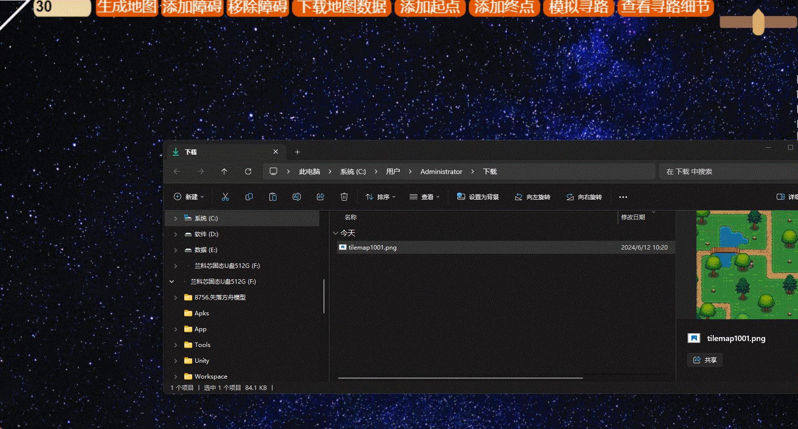
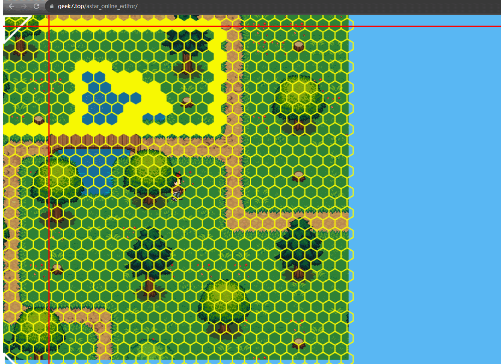
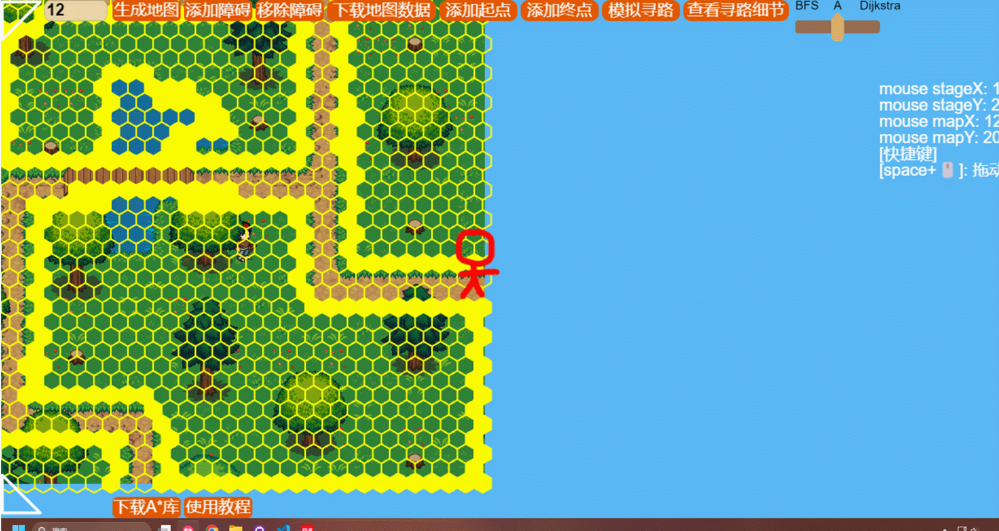
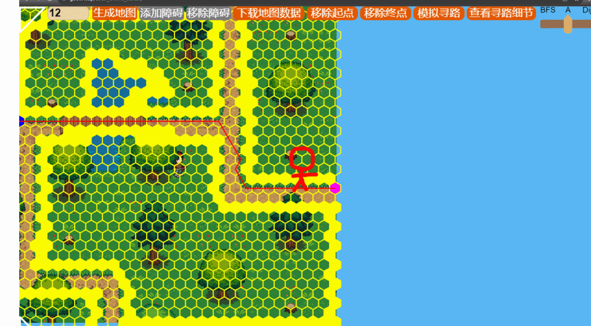
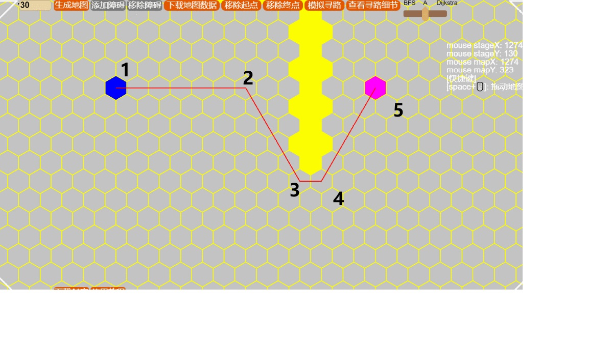
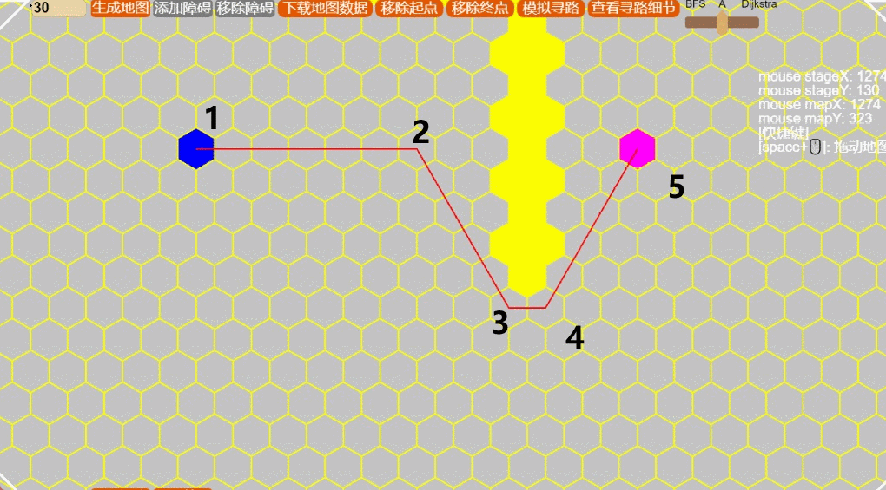

# A*寻路在线编辑器
## 支持
- 自定义地图节点
- 多地图
- 地图数据生成/导入

## 优化细节:
### 1. 使用二进制转换的方式将坐标转换成number类型的key 去查询节点, 相对于传统的string类型,提升了访问速度同时做到了零GC

```typescript
       get key(): number {
            //这个值可以根据实际情况来调整 
            //12位的最大存储值是4096  x,y不能超过4096 
            //你可以上调但要保证不能溢出 也可以根据实际情况 下调  
            return this.x << 12 | this.y;
        }
        /**
         * 可以通过key来反推出x,y坐标值
         * 静态方法
         * @param key 
         * @returns 
         */
        public static key2Coord(key: number) {
            return new Coord(key >> 12 & 0xfff, key & 0xfff);
        }
```
### 2. 对寻路的路线进行了优化,在寻路完成后,优化后的路线更加笔直不会拐来拐去


# 使用教程
## 导入一张地图背景, 图片名要和游戏内加载的名字保持一致


## 添加/移除障碍


## 寻路可视化


## 模拟寻路


## 使用文档
https://blog.csdn.net/qq_39162566/article/details/126552533

# TODOLIST:

## 对一阶段优化的寻路节点再次优化

### 优化前 ( 草图 )


### 优化后 ( 草图 )


1. 在现有1一阶段优化后,只会有几个关键的拐点
2. 将这几个拐点依次从 第一个节点开始,间隔一个节点设为终点
3. 通过射线原理去检测 两个节点间是否有障碍节点
4. 如果没有既可判定可以从 1 -> 3, 去掉中间的2节点
5. 依次递推下去, 直到优化所有节点
6. 最终, 角色将以最少的拐角最快的路线到达终点
